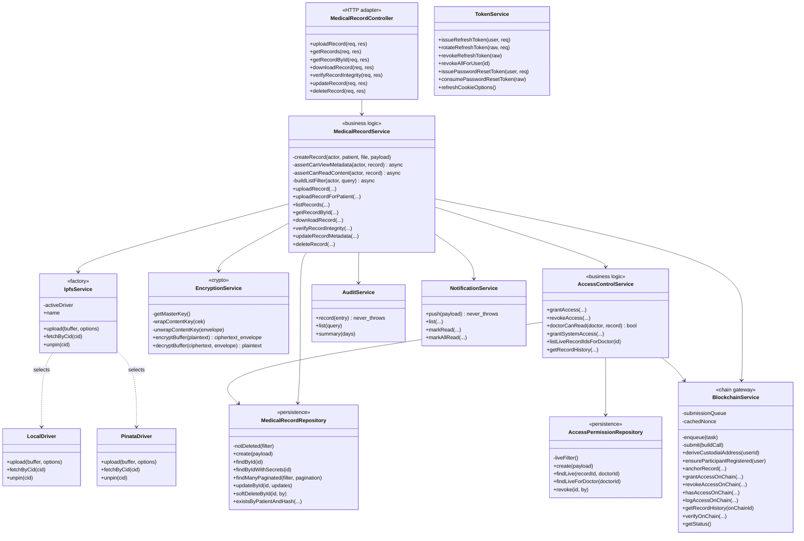
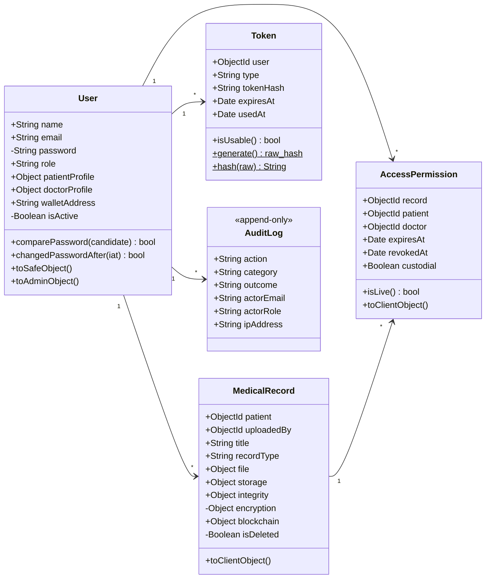
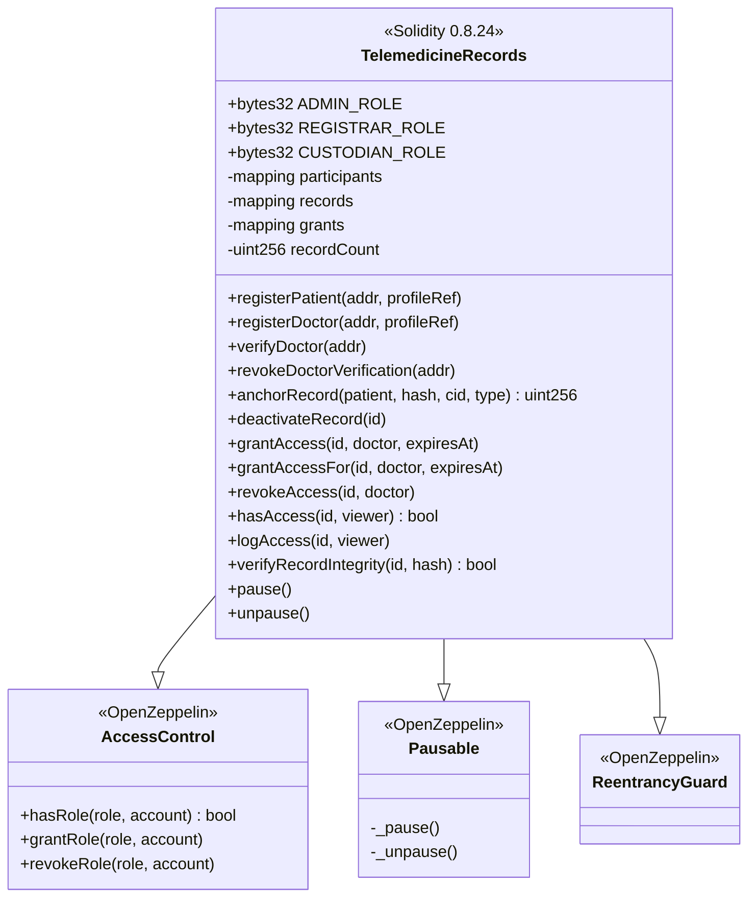

# Class Diagram

JavaScript modules rather than literal classes, so this shows the *layer
contracts*: what each module exposes and what it depends on. The dependency
arrows all point one way, which is the property that keeps the layers honest.

## Backend layers

## Mongoose models

## Smart contract

## The rule these diagrams encode

Dependencies point **downward only**: controller → service → repository →
model. A repository never imports a service; a model never imports anything
above it. That is what makes the service layer testable in isolation and the
persistence engine replaceable.

`EncryptionService` is the only module that touches the master key.
`BlockchainService` is the only module that imports ethers. `IpfsService` is the
only module that knows which storage provider is in use. Each of those is a
single, auditable place to review — which is the actual point of the layering.
