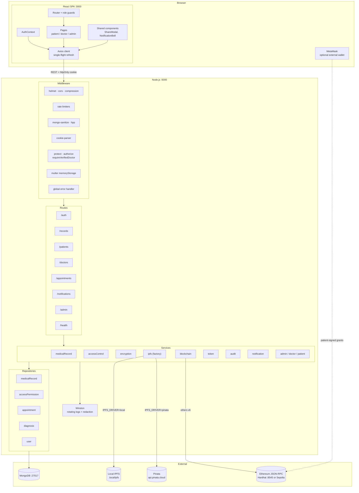
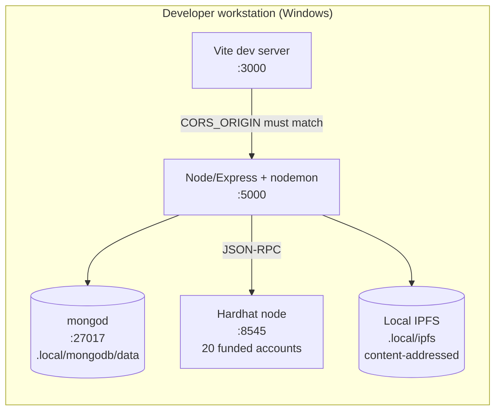
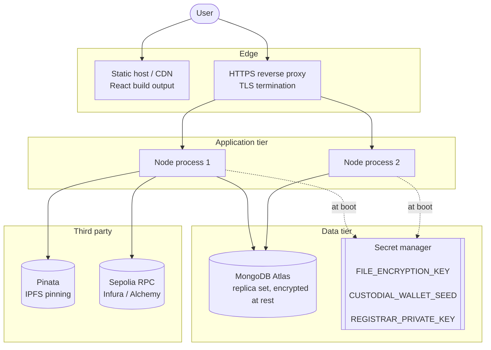

# Component & Deployment Diagrams

## Component diagram

### Interfaces between components

| From | To | Contract |
| --- | --- | --- |
| React | Express | REST/JSON, `{status, message, data}`; Bearer header + httpOnly refresh cookie |
| Controller | Service | plain objects — no `req`/`res` beyond audit context |
| Service | Repository | intent methods; no Mongoose query syntax crosses the boundary |
| Service | IpfsService | `upload` / `fetchByCid` / `unpin` — provider-agnostic |
| BlockchainService | Contract | ABI from `deploy.js`, serialised nonce queue |
| MetaMask | Contract | direct `grantAccess` for patients with a linked wallet |

## Deployment diagram — development

Everything runs on one machine with **no third-party credentials**: the local
IPFS driver and Hardhat's in-memory chain stand in for Pinata and Ethereum.

## Deployment diagram — production

### What must change before this is production-safe

- **Secrets leave `.env`.** `FILE_ENCRYPTION_KEY`, `CUSTODIAL_WALLET_SEED` and
  `REGISTRAR_PRIVATE_KEY` belong in a managed secret store. Losing the first
  makes every record unreadable; losing the third lets an attacker anchor and
  grant at will.
- **`BLOCKCHAIN_CONFIRMATIONS` above 1.** A public chain can reorg; one
  confirmation does not protect against that.
- **`CUSTODIAN_ROLE` revoked** once patients hold their own wallets, so grants
  are genuinely patient-signed.
- **Horizontal scaling caveat.** `blockchainService` serialises transactions
  behind an *in-process* nonce counter. Two Node processes sharing one registrar
  key would collide. Either give each process its own key, or move anchoring to
  a single-consumer queue.
- **Rate limiting shared.** `express-rate-limit` defaults to in-memory counters,
  which are per-process. Back it with Redis so limits apply across instances.
- **`secure: true` cookies** — already conditional on `NODE_ENV=production`, so
  TLS is mandatory.
