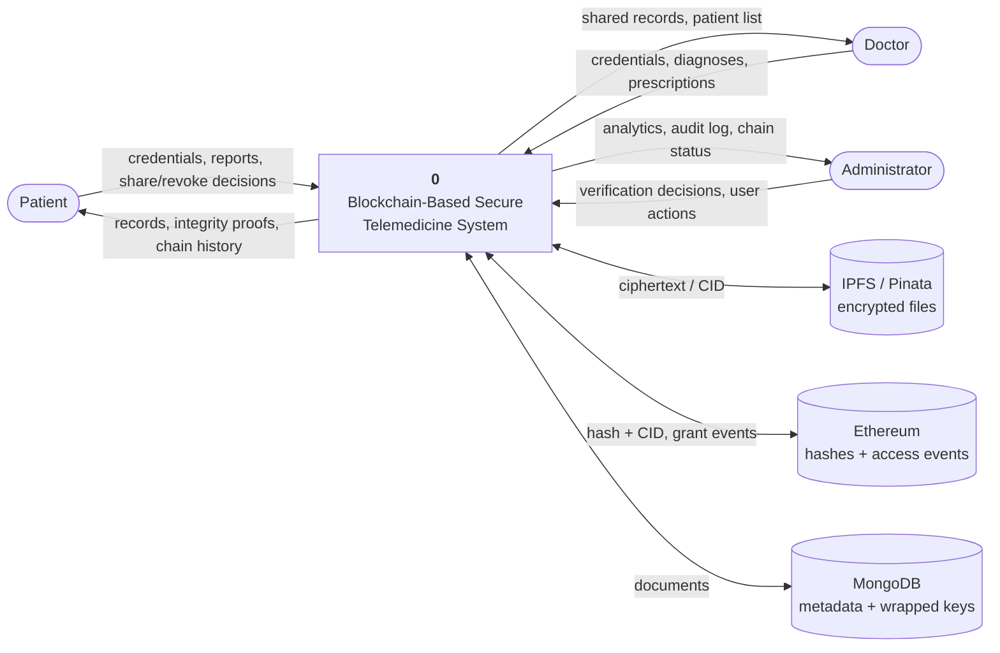
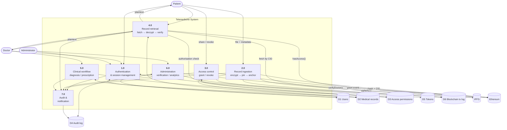
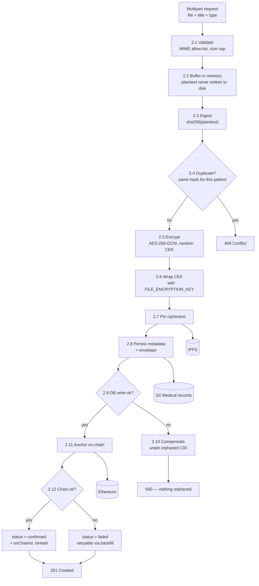
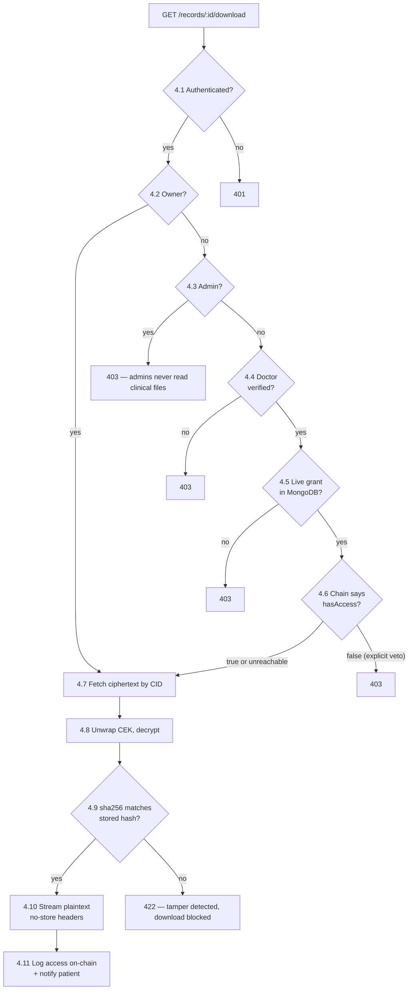

# Data Flow Diagrams

## Level 0 — Context diagram

## Level 1 — Major processes

## Level 2 — Process 2.0, record ingestion

The process that carries the project's core claim, expanded.

**Why 2.10 exists.** The pin succeeds before the database write. Without a
compensating unpin, a failed metadata write would leave an encrypted blob on
IPFS that nothing in the system can ever reference or clean up.

**Why 2.12 does not fail the request.** By that point the file is encrypted,
pinned and persisted. A chain outage leaves `blockchain.status: "pending"` and
`npm run backfill:anchors` re-drives it — losing an upload because a node was
briefly unreachable would be the wrong trade.

## Level 2 — Process 4.0, retrieval with authorisation

**Why 4.6 admits an unreachable chain.** Authorisation is checked twice:
MongoDB decides, and the chain may *veto*. If the node cannot be reached the
database decision stands — a blockchain outage locking clinicians out of patient
data is the wrong failure mode for a medical system. The chain can only ever
narrow access, never widen it.

**Why 4.9 exists on top of GCM.** The authentication tag already proves the
ciphertext was not modified. This second check also catches a storage layer that
silently returned the *wrong object*, and it is the same comparison the contract
performs against the on-chain hash.
