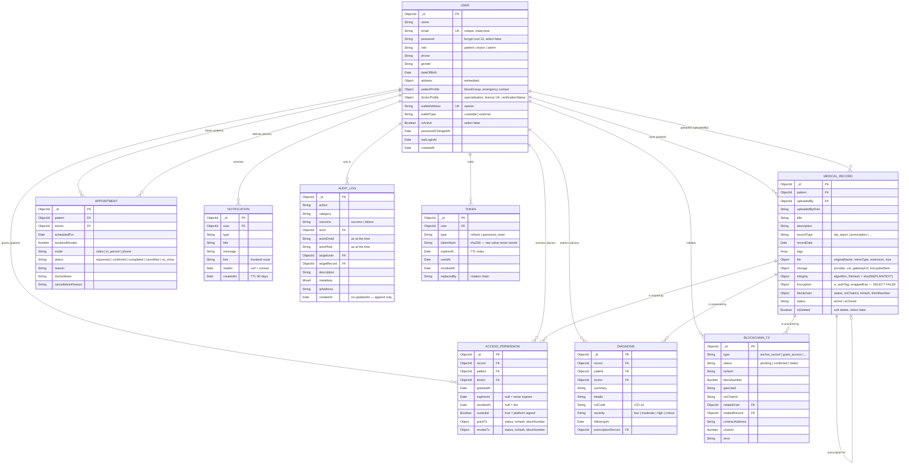

# Entity Relationship Diagram

MongoDB is document-oriented, so this is a *logical* ER model: "foreign keys"
are `ObjectId` references resolved by Mongoose `populate`, not database-enforced
constraints.

## Design decisions worth defending

**One `USER` collection, not three.** Patients, doctors and admins share
identity, authentication and contact fields. Splitting them would duplicate all
of that and make "find the user with this email" a three-collection query. Role
is a discriminator; role-specific fields live in `patientProfile` /
`doctorProfile` subdocuments, and Mongoose applies conditional `required`
validators so a doctor cannot be created without a licence number.

**`encryption` is `select: false`.** Key material is excluded from every query
by default and must be explicitly requested by the two code paths that need it
(download and integrity verification). A forgotten projection therefore cannot
leak it.

**`integrity.fileHash` is the digest of the plaintext, not the ciphertext.** It
stays a stable identity for the *document* regardless of how it was encrypted or
which provider stored it — which is why it is the value anchored on-chain.

**Soft delete, never hard delete.** `isDeleted` is excluded at the repository
boundary so no caller can leak a deleted record by forgetting a filter. The row
and its on-chain anchor survive; only the encrypted blob is unpinned.

**Partial unique index on `ACCESS_PERMISSION`.** `{ record, doctor }` is unique
only where `revokedAt: null`, so at most one *live* grant exists per pair while
every historical revocation is retained.

**Only token hashes are stored.** A stolen database yields no usable refresh or
reset token. SHA-256 rather than bcrypt is correct because these are 32 bytes of
CSPRNG output — there is no low-entropy guess for a slow hash to defend against.
