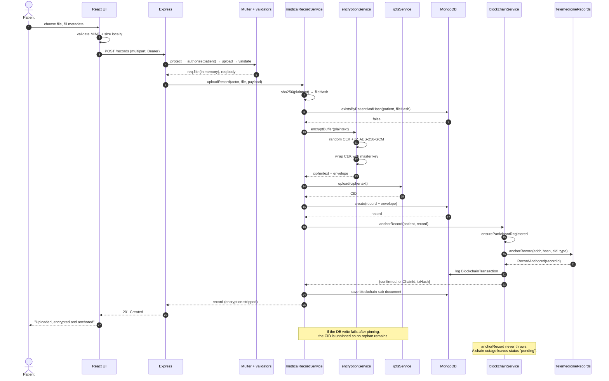
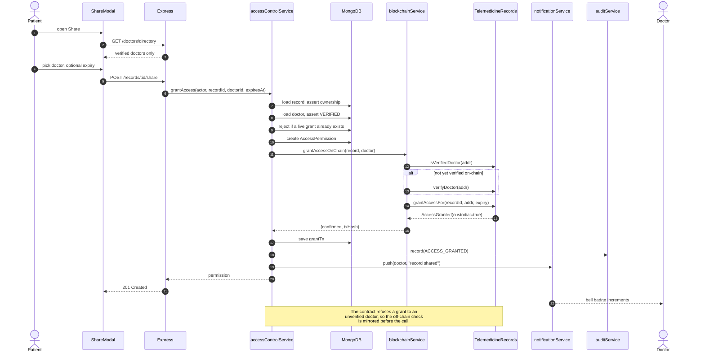
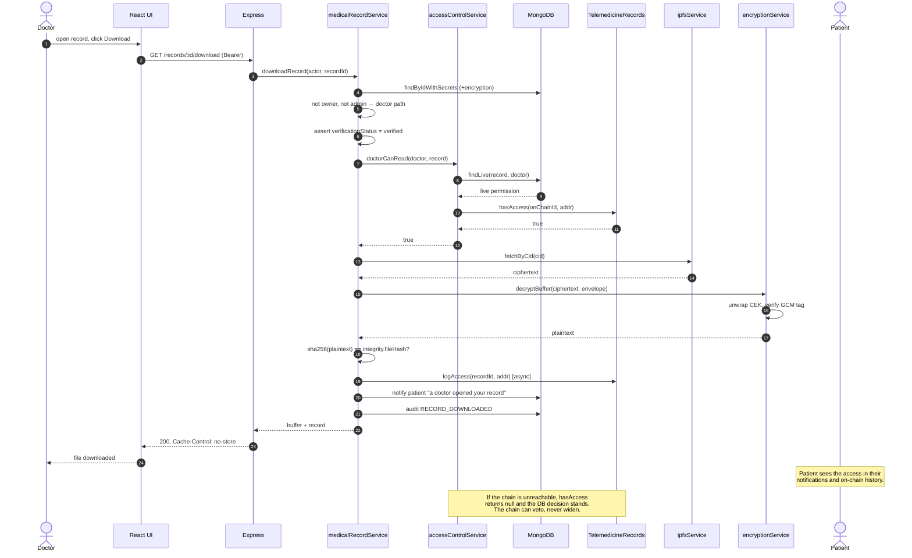
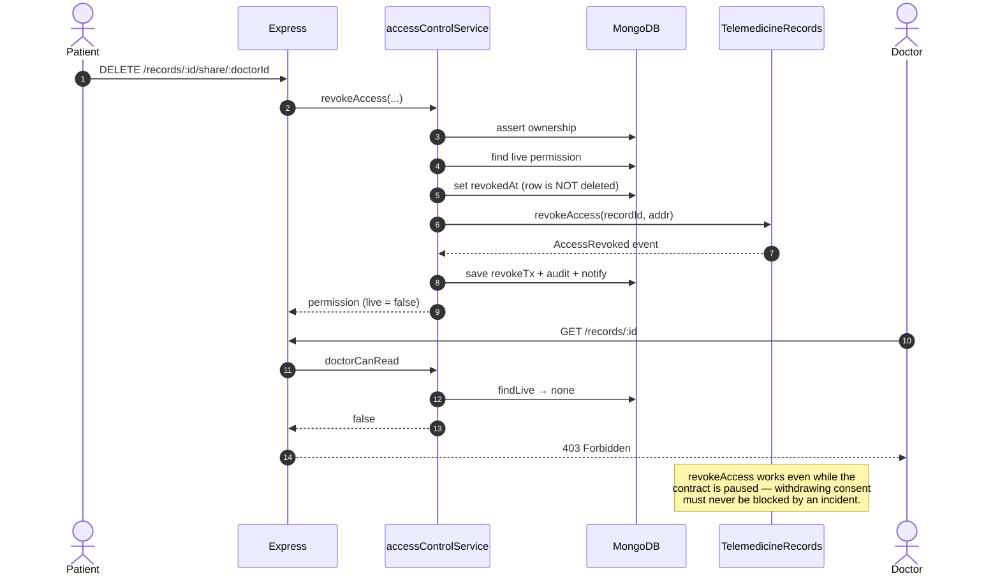
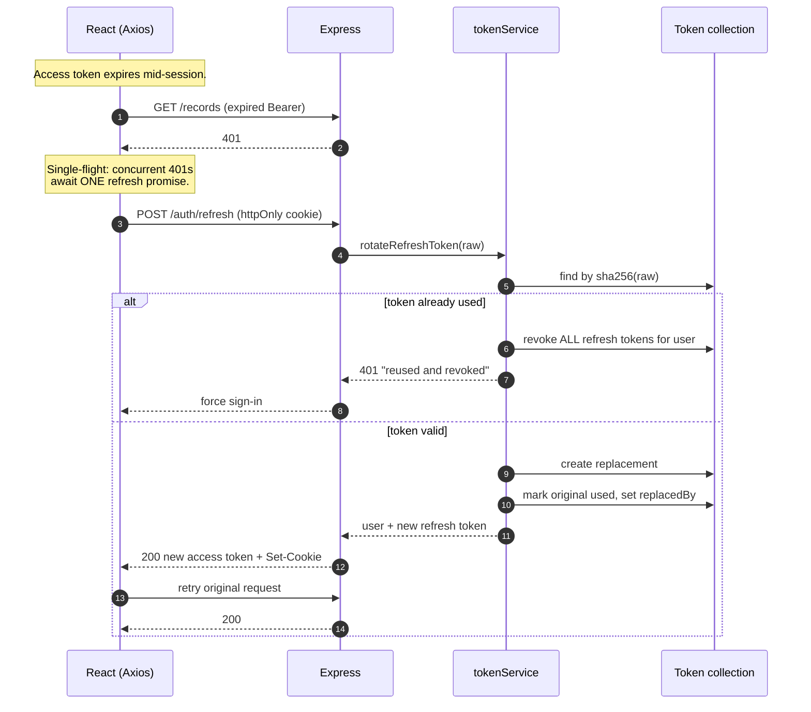

# Sequence Diagrams

## 1. Upload a medical record



## 2. Patient grants a doctor access



## 3. Doctor reads a shared record



## 4. Revoking access



## 5. Session refresh with rotation



**Why single-flight matters.** Because reuse triggers family-wide revocation, N
parallel refresh calls would make the 2nd through Nth present an already-spent
token and log the user out. The client must serialise refreshes; the frontend
interceptor shares one promise across all queued requests.

## 6. Admin verifies a doctor

```mermaid
sequenceDiagram
    autonumber
    actor A as Admin
    participant API as Express
    participant DB as MongoDB
    participant BC as blockchainService
    participant CON as TelemedicineRecords
    actor D as Doctor

    A->>API: PATCH /admin/doctors/:id/verify
    API->>DB: assert doctor exists and is active
    API->>DB: verificationStatus = verified, verifiedBy, verifiedAt
    API->>BC: verifyDoctorOnChain(doctor, adminId)
    BC->>CON: ensureParticipantRegistered → registerDoctor
    BC->>CON: verifyDoctor(addr)
    CON-->>BC: DoctorVerified event
    BC->>DB: log BlockchainTransaction
    API->>DB: audit DOCTOR_VERIFIED
    API->>DB: notify doctor
    API-->>A: 200 + onChain result
    Note over D: Doctor's portal unlocks; patients<br/>can now share records with them.

    Note over API,BC: On-chain mirroring is best-effort.<br/>The off-chain decision stands either way,<br/>and grantAccessOnChain self-heals later.
```
